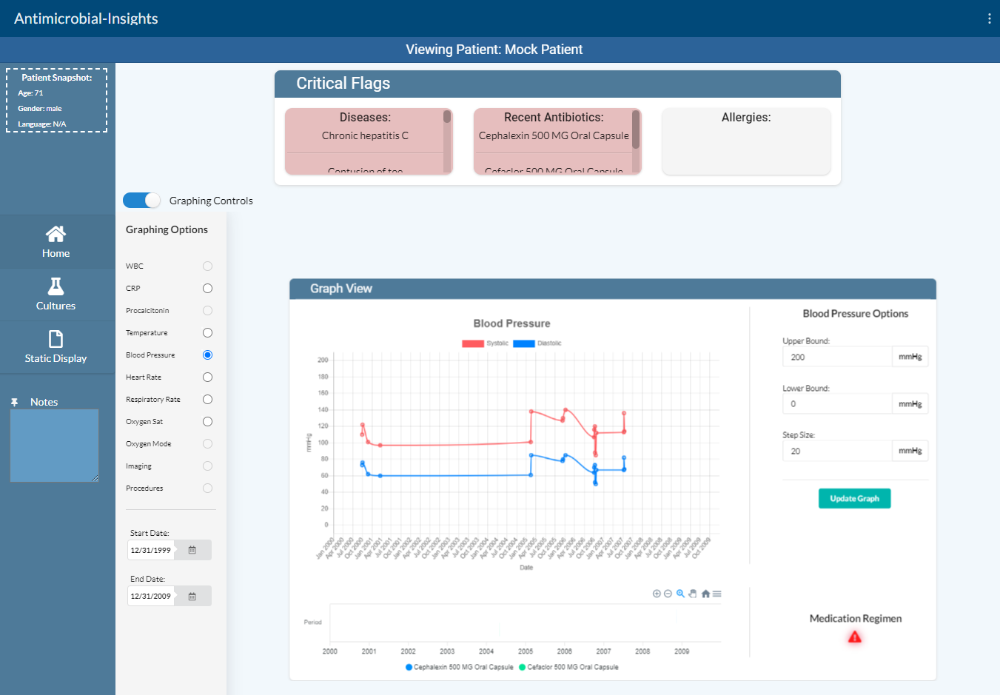
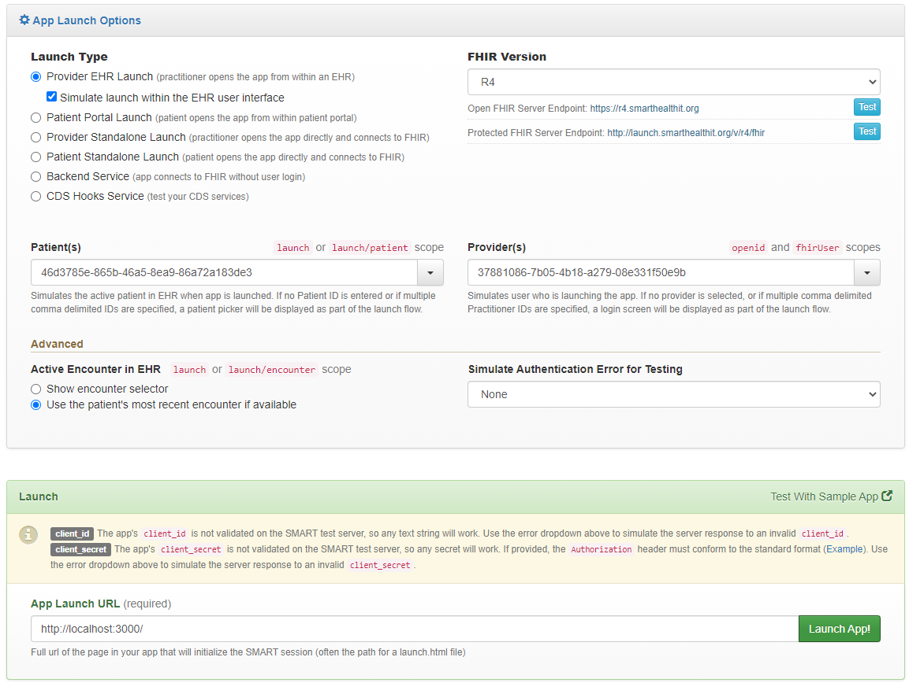
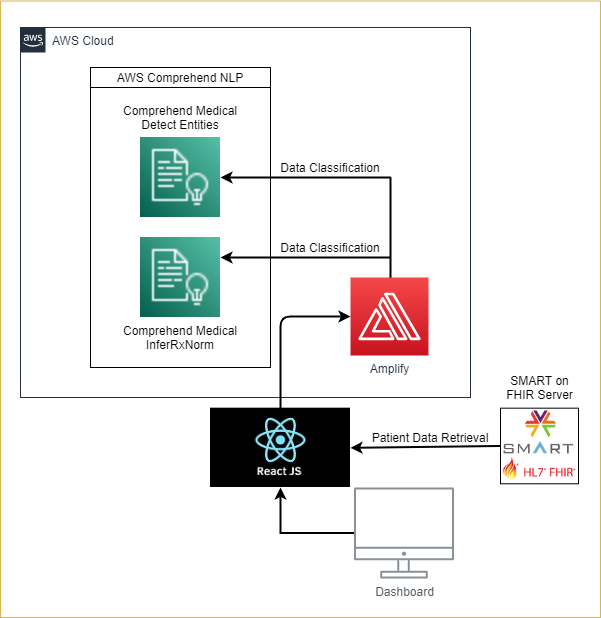

# Antimicrobial Insights SMART on FHIR Application
Antimicrobial Insights is a **prototype** SMART on FHIR clinical decision support application that aims to display relevant patient electronic health record (EHR) information to clincial professionals when dealing with infection cases. We hope that this serves as a demonstration of what's possible when third party applications are integrated with Smart on FHIR compatible Electronic Medical Record systems. Specialized views of patient data helps healthcare providers focus on the information that matters.

|Index| Description|
|:----------------|:-----------|
| [Stack](#stack)         |     The application stack.    | 
| [Demo](#demo)         |     Interact with Antimicrobial Insights application.    |
| [High Level Architecture](#architecture)         |    Learn about the application architecture. |
| [Development](#development)         |    Learn how we developed this application. |
| [Deployment](#deployment)         |    Learn how to deploy this project yourself. |
| [Disclaimer](#disclaimer)         |    Project disclaimer. |
| [License](#license)      |     License details.     |

# Stack

* **Front-end** - ReactJS on NodeJS as the core framework. It utilizes the SMART on FHIR framework (FHIR version R4) for EHR launches.
* **Hosting** - AWS Amplify.
* **Backend** - In the backend, we are using AWS Comprehend Medical to aid in patient data classification and filtering. 

# Demo

### *By using this application, you are agreeing to the [disclaimer](#disclaimer)*.

Try launching the application yourself using the [live demo application](). You will need to launch the application from a SMART on FHIR compliant EMR emulator. There are a number of of different ones available but we recommend using the [Smart App Launcher Sandbox](https://launch.smarthealthit.org/) as it does not require any code modifications to run. 

You can use the following settings shown below to launch the demo:

*For the "App Launch URL", you can use either "http://localhost:3000/" if you're running this project locally, or if you're using the live demo application, use the URL for the app.*

# High Level Architecture

# Development
To learn more details about this application, please read our [Development Document](./docs/development_document.md) 

# Deployment
To deploy this solution into your AWS Account please follow our [Deployment Guide](./docs/deployment_guide.md)

# Disclaimer
This application is not intended to be a substitute for professional medical advice, diagnosis, or treatment. Always seek the advice of your physician or other qualified health provider with any questions you may have regarding a medical condition. Use of this application or any information provided by this application **is solely at your own risk**.
This application is for **demonstration purposes only**.

# Changelog
* March 8, 2021: Initial release.

# License
This project is distributed under  [Apache-2.0](https://github.com/UBC-CIC/antimicrobial_app_smart_fhir/blob/main/LICENSE) 
