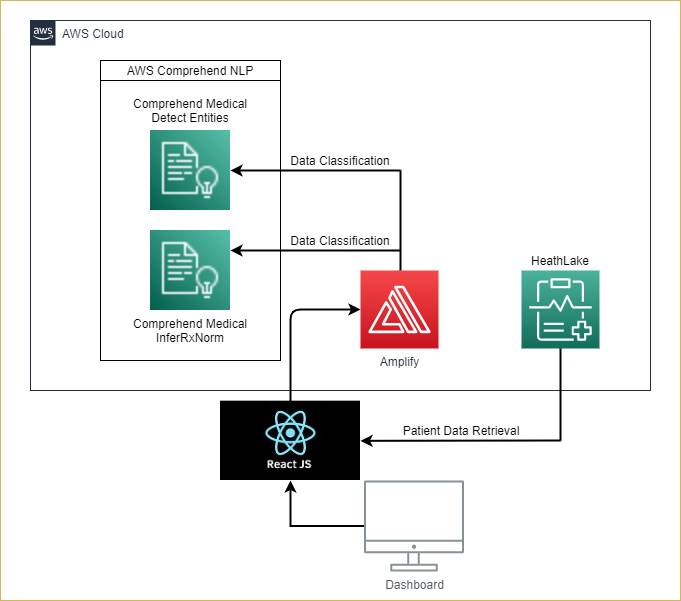

# Antimicrobial FHIR App (with Amazon HealthLake Integration)
Antimicrobial Insights (with Amazon HealthLake) is a prototype FHIR clinical decision support application that aims to display relevant patient electronic health record (EHR) information to clincial professionals when dealing with infection cases. Specialized views of patient data helps healthcare providers focus on the information that matters.

|Index| Description|
|:----------------|:-----------|
| [Stack](#stack)         |     The application stack.    | 
| [Demo](#demo)         |     Interact with Antimicrobial Insights application.    |
| [High Level Architecture](#architecture)         |    Learn about the application architecture. |
| [Development](#development)         |    Learn how we developed this application. |
| [Deployment](#deployment)         |    Learn how to deploy this project yourself. |
| [License](#license)      |     License details.     |

# Stack

* **Front-end** - ReactJS on NodeJS as the core framework. It utilizes the FHIR framework (FHIR version R4) and interfaces with Amazon HealthLake.
* **Hosting** - AWS Amplify.
* **Backend** - In the backend, we are using AWS Comprehend Medical to aid in patient data classification and filtering. 

# High Level Architecture

# Development
To learn more details about this application, please read our [Development Document](./docs/development_document.md) 

# Deployment
To deploy this solution into your AWS Account please follow our [Deployment Guide](./docs/deployment_guide.md)

# Changelog
* August 27, 2021: Lastest update.

# License
This project is distributed under  [Apache-2.0](https://github.com/UBC-CIC/antimicrobial_app_smart_fhir/blob/main/LICENSE) 
