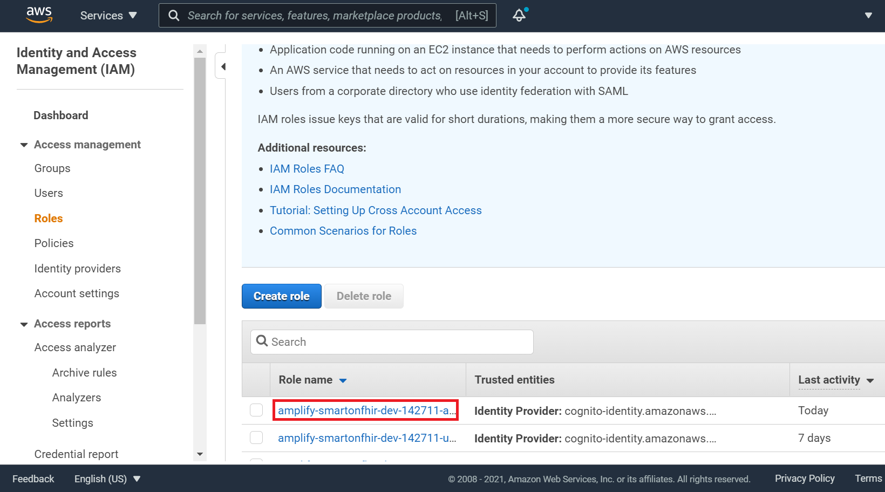

# Deployment Guide

## Requirements
Before you deploy, you must have the following in place:
*  [AWS Account](https://aws.amazon.com/account/) 
*  [GitHub Account](https://github.com/) 
*  [Node 10 or greater](https://nodejs.org/en/download/) 
*  [Amplify CLI 4.13.1 or greater installed and configured](https://aws-amplify.github.io/docs/cli-toolchain/quickstart#quickstart) 
*  [Please register for a UMLS API Key](https://uts.nlm.nih.gov/uts/signup-login)
  


## Step 1: Front-end Deployment
In this step we will use the Amplify console to deploy and build the front-end application automatically. 

[](https://console.aws.amazon.com/amplify/home#/deploy?repo=https://github.com/UBC-CIC/antimicrobial_app_smart_fhir)

1. Fork this repository.
2. **1-click deployment** button above. Make sure to start the deployment before continuing. 
3. Go to the [Amplify Console](https://console.aws.amazon.com/amplify/home).
4. Select the **smartonfhir** app.
5. Wait until **Provision, Build, Deploy and Verify** are all green. 
6. In the left-hand menu under *App Settings*, click on **Environment Variables** then **Manage variables**.
7. Please add the following environment variables:
   ```javascript
   Variable: REACT_APP_UMLS_API_KEY         Value: <Your UMLS API Key>
   Variable: REACT_APP_AWS_REGION           Value: ca-central-1
   ```
8. Click **Save**.

---

## Step 2: Add Permissions
In this step we will attach a policy to an Amplify created Cognito Role.

1. In the AWS Console, go to the AWS IAM service page.
2. In the left-hand menu, click on **Roles**.
3. Click on the role named "amplify-smartonfhir-dev-{Some number}-authRole".



4. Next, click the **Attach policies** button.
5. In the search box, type "ComprehendMedical", then select the checkbox for "ComprehendMedicalFullAccess".
6. Click **Attach policy**.
