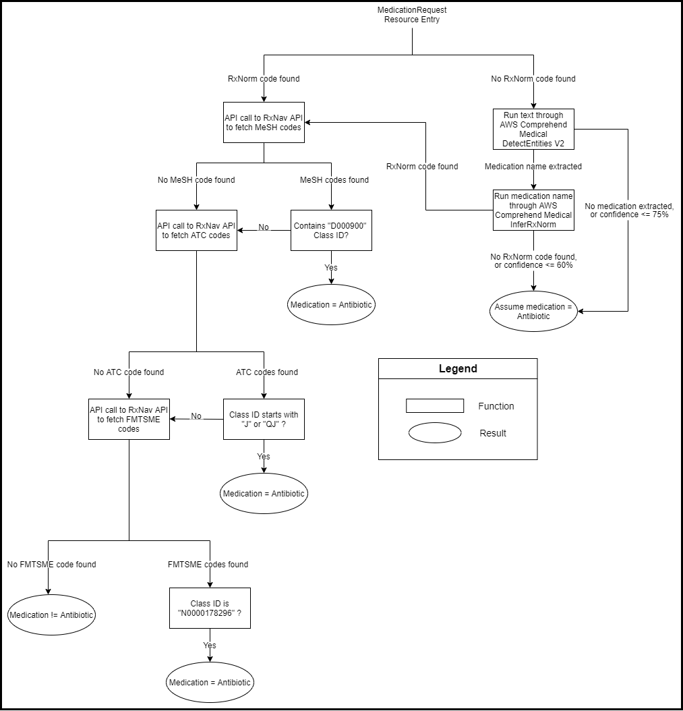

# Development Document

This document will go over a few implementation details of this application.

## Interfacing with SMART on FHIR compliant EMR servers

This application utilizes the [SMART on FHIR framework](https://docs.smarthealthit.org/) which allows it to interface with SMART on FHIR compliant Electronic Medical Record (EMR) systems. We utilized the [SMART Client JS library](http://docs.smarthealthit.org/client-js/) to help us interface and securely launch the application from EMR servers.

- Using the SMART JS Client library, the solution requests authorization from the EMR server. The solution needs to be registered with the EMR server prior to use, and the unique Client ID must be specified in the src/index.js file for successful authorization. 
 - The following scope permissions (specified in the src/index.js file) are required for the successful launch of the solution:  

Scope definitions below are referenced from [Cerner's SMART on FHIR tutorial](https://engineering.cerner.com/smart-on-fhir-tutorial/)

|Scope| Description|
|:----------------|:-----------|
|  openid, profile        |     Permission to retrieve information about the current logged-in user.    | 
|  launch        |   Permission to obtain launch context from an EHR.      |
|  online_access        |  Permission to request a refresh token to obtain a new access token to replace an expired on. Remains usable as along as user remains online.    |
|  patient/Patient.read, patient/Observation.read, patient/Procedure.read, patient/AllergyIntolerance.read, patient/MedicationRequest.read/ patient/ServiceRequest.read, patient/DiagnosticRequest.read        | Permission to read the relevant resources for the current patient.    |

- After successful authorization with the EMR, a FHIR client instance is initialized within the context of the current patient. The solution then launches and starts loading.
- The FHIR client is then used to query patient information from the following FHIR Resources on the EMR server: 

|Resource| Information Obtained|
|:----------------|:-----------|
|  Patient        |     patient personal details (name, age, address, etc.)    | 
|  Observation        |   lab data, vitals (blood pressure, heart rate, etc.), imaging, social history, clinical assessment      |
|  Procedure        |  operations, counselling    |
|  AllergyIntolerance        | allergies, intolerances    |
|  MedicationRequest        |  prescriptions   |
|  DiagnosticReport        |   laboratory, pathology, and imaging reports        |
|  ServiceRequest        |     record of a procedure or diagnostic request     |
 

## Filtering and processing patient data for visualization

- The solution checks the medication data (from the Medication resource) for any RxNorm codes (RxCUIs). If it exists, it goes through a series of checks using the [RxNav API](https://mor.nlm.nih.gov/download/rxnav/) to retrieve the corresponding ATC, MeSH, and FMTSE codes to identify if the medications are antibiotics or not.
- If the no RxNorm codes exist for the medication, it then gets transmitted to the AWS Comprehend Medical Detect Entity API for analysis to extract the medication name from the prescription. After which, the result is sent to the [AWS Comprehend Medical](https://aws.amazon.com/comprehend/medical/) InferRxNorm API to identify a corresponding RxNorm code (RxCUI). After which, it goes through the same identification process as above.

### MedicationRequest Processing Flow Chart:

- The solution filters out any non-medication allergies (from the AllergyIntolerance resource) by checking the category field of the entry. If the category field does not exists, the allergy description is run through the [AWS Comprehend Medical](https://aws.amazon.com/comprehend/medical/) Detect Entity API to determine if it contains a medication.
- The solution filters out entries from the Observation resource and checks the code field to determine the type of data it contains. The solution then matches the code against a list of relevant SNOMED or LOINC codes to determine the data type (blood pressure, heart rate, etc.).  

## General Design

- The solution was designed as a web application using the [ReactJS](https://reactjs.org/) framework on NodeJS.
- The web application is integrated with [AWS Amplify](https://aws.amazon.com/amplify/), and it provides the application with user authentication capabilities via [AWS Cognito](https://aws.amazon.com/cognito/).
- User authentication/login can be removed from the application if desired for production usage. 

